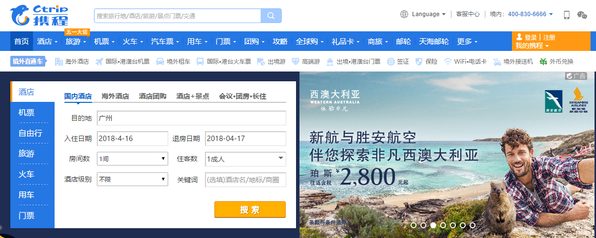

### 1. 用例建模
- a.阅读Asg_RH文档，绘制用例图。按照Task1要求，请使用工具UMLet，截图格式务必是png并控制尺寸 
    
- b.选择你熟悉的定旅馆在线服务系统（或移动App），如如绘制用例图。并满足以下要求：
    - 对比Asg_RH用例图，请用色彩标注出创新用例或子用例 
    
    - 尽可能识别外部系统，并用色彩标注新的外部系统和服务
    携程网站上的酒店预订流程如下
     
     
     
     
     
    
- c.对比两个时代、不同地区产品的用例图，总结在项目早期，发现创新的思路与方法
    在项目早期的创新往往需要参考以往已经存在的类似产品，了解这些产品的功能，画出它们的用例图，确定基本实现思路，要实现创新还需要通过调查了解各种顾客对产品的需求，考虑不同人群对产品的需求，来添加一些其他产品没有考虑的功能和用例
   
- d.请使用SCRUM方法，在(任务b)用例图基础上，编制某定旅馆开发的需求(backlog)
    1. 搜索酒店：在首页选择城市、入住和退房日期， 选填关键词、酒店等级，点击搜索按钮
    2. 预定酒店：在酒店列表点击表项进入酒店详情页面，查看酒店可订的房型、相应日期、酒店地址，点击预定按钮
    3. 确认订单：查看详细订单，修改房间数量、预计到店时间，可选择购买保险，填写手机号码选填email确认订单
    4. 付款：选择付款方式，进行付款

### 2. 业务建模
- a.在(任务b)的基础上，用活动图建模找酒店用例。简述利用流程图发现子用例的方法 
     
    用流程图发现子用例的方法：沿着流程图的开始状态，选择流程图中的任意一个分支到流程图的结束状态，就得到了一个子用例。
- b.选择你身边的银行ATM，用活动图描绘取款业务 
    
- c.查找淘宝退货业务官方文档，使用多泳道图，表达客户、淘宝网、淘宝商家服务系统、商家等用户和系统协同完成退货业务，在淘宝网上需要实现哪些系统用例 
     
    淘宝需要实现的系统用例有：生成退款单、管理退款单、同意/不同意退款处理
### 3. 用例文本编写
- 在大作业基础上，分析三种用例文本的优点和缺点
    - Brief：一段简洁的摘要
        - 优点：简洁明了、易于编写
        - 缺点：不够细致，只能提供粗略的分析
    - Casual：非正式的覆盖多种场景的段落
        - 优点：较Brief用例文本详细，
        - 缺点：不够正式
    - Fully：详细地编写用例所有步骤和各种变化，同时补充前置条件和成功保证等。Fully用例文本通常用在以摘要形式编写了很多用例以后，详细地编写其中少量具有重要意义和价值的用例
        - 优点：细节充足，具有结构性
        - 缺点：编写工作比较繁琐