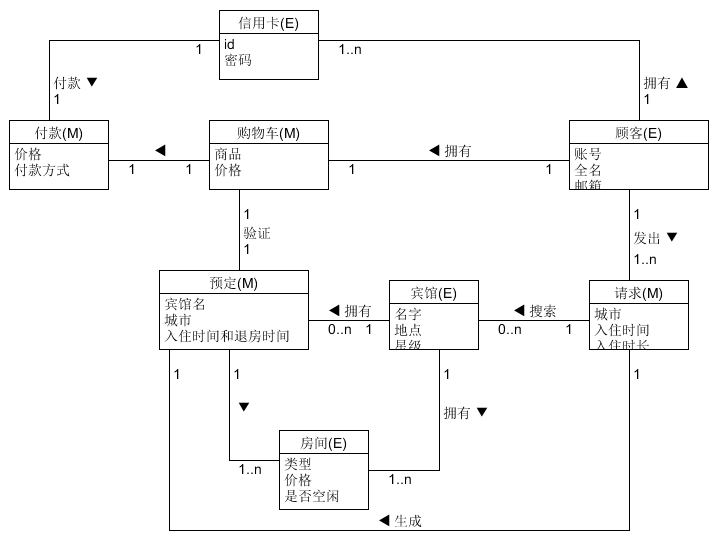
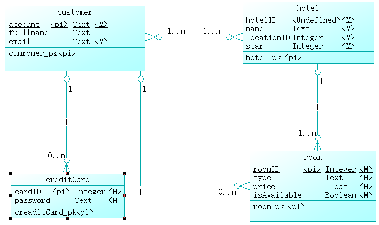

---
layout: post

title: HW5

date: 2018-4-27 12:00:10+00:00

categories: 日志

tags: 博客

---

### 1、领域建模
- a. 阅读Asg_RH文档，按用例构建lingua模型。
    - 按Task2要求，请使用工具UMLet，截图格式务必是png并控制尺寸
    - 说明：请不要受PCMEF层次结构影响。你需要识别实体（E）和中介实体（M，也称为状态实体）
        - 再单页面应用（如vue）中，E一般与数据库构建有关，M一般与store模式有关
        - 再java web应用中，E一般与数据库构建有关，M一般与session有关
    - 
- b. 数据库建模（E-R模型）
    - 按Task3要求，给出系统的E-R模型（数据逻辑模型）
    - 建模工具PowerDesigner（简称PD）或开源工具OpenSystemArchitect<br/>
    
    - 不负责的链接 http://www.cnblogs.com/mcgrady/archive/2013/05/25/3098588.html
    - 导出Mysql物理数据库的脚本
    
```
drop table if exists Cunstomer;
drop table if exists CreditCard;
drop table if exists Hotel;
drop table if exists Room;

create table CreditCard
(
   cardID                longtext not null,
   password              char(20),
   constraint PK_CREDITCARD primary key (cardID)
);

create table Cunstomer
(
   account                longtext,
   fullname               longtext,
   email                  longtext,
   hotelID                longtext,
   constraint PK_CUNSTOMER primary key (account)
);

create table Hotel
(
   hotelID                int               not null
   name                   longtext          not null,
   location               int               not null
   star                   int               not null
   constraint PK_HOTEL primary key (room)
);

create table Room
(
    roomID                int               not null
    type                  longtext          not null
    price                 float             not null
    isAvailable           boolean           not null
    constraint PK_ROOM primary key(roomID)
);

alter table Customer add constraint FK_REFERENCE1 foreign key (hotelID)
      references hotel (hotelID) on delete restrict on update restrict;

alter table creditCard add constraint FK_REFERENCE2 foreign key (account)
      references Customer (account) on delete restrict on update restrict;

alter table room add constraint FK_REFERENCE3 foreign key (hotelID)
      references hotel (hotelID) on delete restrict on update restrict;

alter table room add constraint FK_REFERENCE4 foreign key (account)
      references Customer (account) on delete restrict on delete restrict;
```
    - 简单叙说数据库逻辑模型与领域模型的异同:
        - 相同点：抽象概念，将需求抽象为可视化的概念关系
        - 不同点：领域模型是对领域内概念类或现实世界对象的一种抽象的可视化表示，主要关注现实世界行为、对象和各种概念，挖掘问题域中核心的概念，并建立领域概念之间的关系；而逻辑模型则是领域模型的进一步细化，需要摒弃与具体实现无关的概念以及将需要的概念进一步细化成数据库、类对象等细节