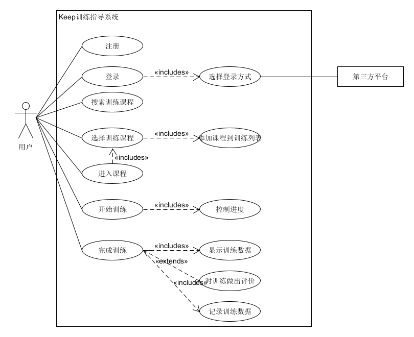
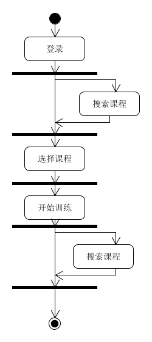
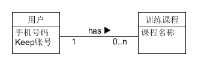
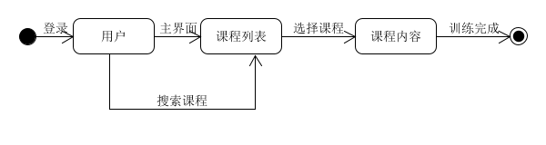
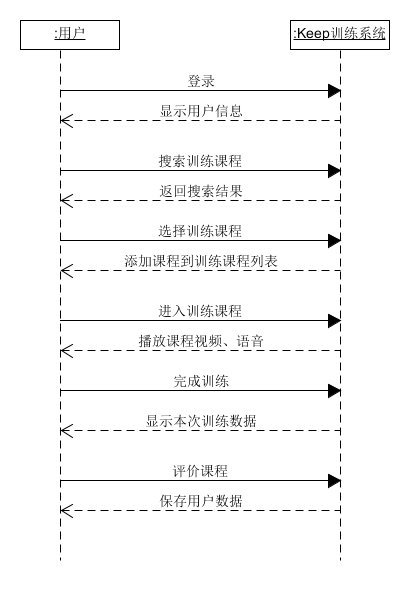

### 建模联系 要求
- 联系文档编写
    - 选择一个你喜欢的移动APP或其中某业务
    - 参考Asg_RH文档格式编写软件描述
    - 文档要包含一个业务的完整过程
    
- 建模要求包括(用例图、XX业务或用例的活动图、XX领域模型、XX对象的状态图、XX场景的系统顺序图与操作协议)
- 建模这答案：
    - 收集及按摩着答案URL
    - 建模者不能是本团队成员(至少有一个答案)
    - 给建模者给出评价与建议

[建模案例：Keep训练指导功能业务文档](https://github.com/OrderingService/Dashboard/blob/gh-pages/XX_exercise/XX1-Keep.pdf)

1. 用例图 

2. XX业务或用例的活动图 

3. 领域模型 

4. 订单对象的状态图 

5. XX场景的系统顺序图与操作协议 

