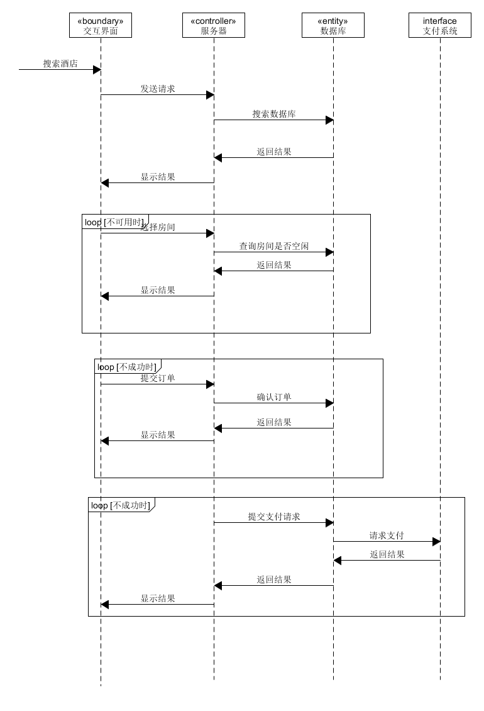
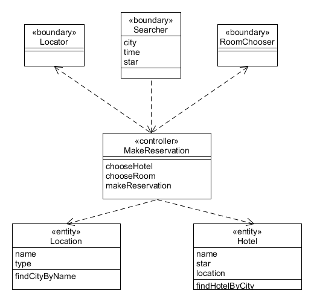
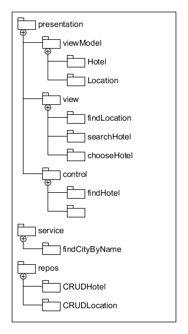

- 使用ECB实现make reservation咏柳的详细设计（包括用例间接，顺序图，类图）
    1. 用例简介：用户选择位置、入住等条件进行酒店的筛选，从筛选结果中选择合适的酒店，然后在该酒店内根据条件选择房间并提交、支付订单，完成预定
    2. 顺序图： 
    
    3. 类图： 
    
- 将逻辑设计类图映射到实际项目框架的包图。用树形结构表述实现的包和类
    