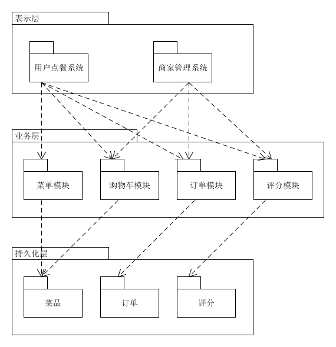

- 描述软件架构与框架之间的区别于联系：
    - 定义：架构是把系统分解为一些部件，描述这些部件的职责及他们之间的协作行为，架构不是软件，而是关于软件如何设计的重要策略；框架是特定语言和技术的架构应用解决方案，是一种特殊的软件，他并不能提供完整无缺的解决方案，而是为你构建解决方案提供了良好的基础，是半成品，
    - 联系：架构和框架技术的出现都是为了解决软件系统日益复杂所带来的困难而采取的“分而治之”思想的结果
    - 区别：
        - 结构不是软件，而是关于软件如何设计的重要策略；框架是一种特殊的软件，它并不能提供完整无缺的解决方案，而是为用户构建解决方案提供了良好的基础，是半成品
        -  架构是问题的抽象解决方案，他关注大局而忽略细节；而框架是通用半成品，还biubiu根据具体需求进一步制定开发才能变成应用系统
- 以你的项目为案例
    - 绘制三层架构模型图，细致到分区 
    
    - 结合你程序的结构，从程序员角度说明三层框架给开发者带来的便利
        1. 每个层或包的职责清晰，具有模块化和可拓展的特点
        2. 前后端分离，利于并行开发
        3. 每个层涉及的技术明确，便于程序员快速上手
        4. 提供了隐式的程序复用准则
- 研究VUE和Flux状态管理的异同
    - 不同点：
        - Flux是一种前端状态管理架构思想，VUE是Flux的一个实现
        - VUE区分同步和异步更改，而Flux不加以区分，
        - 数据流顺序：
            - Flux： View发起Action -> Action传递到Dispatcher -> Dispatcher将通知Store -> Store的状态改变通知View进行改变
            - VUE：View调用store.commit提交对应的请求到Store中对应的mutation函数   ->   store改变生成新的state
        - VUE将action进一步细分为action和mutation，分别对应异步场景和同步场景

    - 相同点：
        - 都通过store来存储状态
        - VUE基于Flux思想
        - 更新和引用的数据流动是单向的