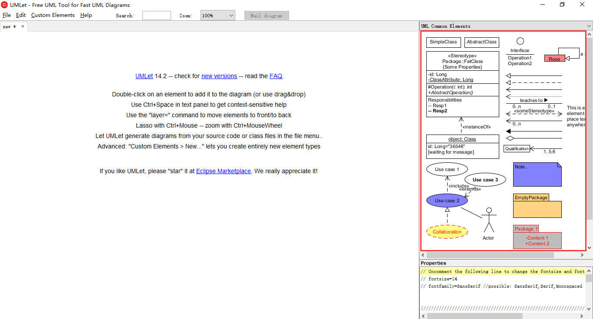

---
layout: post

title: 工具使用说明

date: 2018-4-11 12:00:10+00:00

categories: 日志

tags: 博客

---

### UMLet使用方法
- UMLet是一款具有简单用户界面，免费且开源的UML建模工具，能够快速构建UML序列图、活动图等，并且可以将原型导出为eps，pdf，jpg，svg等格式。UMLet可以独立运行，也提供Eclipse插件版本。
- 用例的定义：用例是描述参与者使用系统来完成某个目标的一系列成功和失败场景的集合
- UMLet的下载和安装：
    - 下载地址： http://www.umlet.com/changes.htm
    - 使用： 下载完成后解压，双击umlet.jar文件即可使用
        1. 添加：双击右上侧区域内要添加的对象，对象即自动添加至面板中 
        
        2. 修改对象属性：选中面板中的对象，在右下角的属性面板中，可以修改对象属性 
        
        3. 保存UML模型图：file -> save
